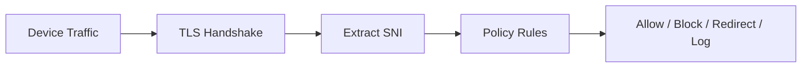
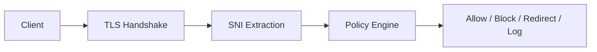

<div align="center">

# 🛰️ SNITracker

### Lightweight TLS SNI Monitoring & Policy Tool

A simple network tool that extracts **Server Name Indication (SNI)** from TLS traffic to provide real-time domain visibility, logging, and basic policy enforcement without decrypting traffic.

---


</div>

---

## ⚠️ Notice

SNITracker is a **network analysis tool** intended only for:

- Educational use  
- Security research  
- Systems you own or are authorized to test  

Do not use it for unauthorized traffic interception.

---

## 🌐 What It Does

SNITracker reads the **TLS handshake** and extracts the SNI (domain name) before the traffic is fully encrypted.

It helps you see which domains are being accessed on a network without decrypting HTTPS traffic.

---

## 🧠 Features

- Extracts SNI from TLS traffic in real time  
- Shows visited domains from encrypted connections  
- Blocks or allows domains using simple rules  
- Logs network activity  
- Can redirect blocked traffic to a warning page  
- Lightweight and written in Python  
- Easy to extend and modify  

---

## 🏗️ How It Works



---

## 📦 Installation

```bash
git clone https://github.com/Mossesmuwa/SNITracker.git
cd SNITracker
pip install scapy
```

> ⚠️ Requires administrator/root permissions to capture network traffic.

---

## 🚀 How to Use

```bash
python sni_logger.py      # Logs visited domains
python sni_filter.py      # Applies blocking rules
python warning_server.py  # Starts warning page server
```

---

## ⚙️ Configuration

### Blocked Domains
```python
BLOCKED_DOMAINS = {"example.com", "badsite.com"}
```

### Warning Server
```python
WARNING_IP = "1.1.1.1"
WARNING_PORT = 8080
```

### Logs
```python
LOG_FILE = "sni_log.txt"
```

---

## 📊 Example Output

```
[2026-06-05 14:32:10] google.com
[2026-06-05 14:32:15] github.com
[2026-06-05 14:32:20] badsite.com → BLOCKED
```

---

## 🚧 Limitations

- Does not decrypt HTTPS traffic  
- Limited with TLS 1.3 Encrypted Client Hello (ECH)  
- Requires admin/root access  
- Works only when SNI is available  
- Not a full firewall or DPI system  

---

## 🧪 Use Cases

- Learning network security basics  
- Monitoring traffic in lab environments  
- Testing simple network policies  
- Security research and experiments  

---

## 🧭 Future Improvements

- Web dashboard for live monitoring  
- GeoIP tracking for domains  
- DNS + SNI correlation  
- Anomaly detection  
- Firewall integration  
- Multi-device monitoring  

---

## ⚙️ Tech Stack

- Python  
- Scapy (packet capture)  
- Raw socket network inspection  

---

## 📄 License

MIT License

---

## 🙌 Inspiration

This project is based on ideas from network security, TLS inspection, and metadata analysis systems.

Key inspiration:

👉 https://youtu.be/FBwHNMgxmhI  
**David Bambal**

> Encrypted traffic still contains useful metadata — and that metadata can reveal important patterns.<div align="center">

# 🛰️ SNITracker

### Lightweight TLS SNI Monitoring & Policy Engine

A high-performance network tool for extracting **Server Name Indication (SNI)** from TLS traffic to enable real-time domain visibility, logging, and policy enforcement without decryption.

---


</div>

---

## ⚠️ Notice

SNITracker is a **dual-use network analysis tool** and should only be used for:

- Authorized security testing  
- Educational and research purposes  
- Systems you own or manage  

Unauthorized use may violate laws.

---

## 🌐 Overview

SNITracker inspects the **TLS handshake** to extract SNI data before encryption hides destination intent.

It provides lightweight metadata-based visibility without decrypting traffic.

---

## 🧠 Features

- Real-time SNI extraction  
- Encrypted traffic domain visibility  
- Domain filtering (block/allow rules)  
- Structured logging  
- Redirect and warning responses  
- Lightweight Python architecture  
- Modular and extensible design  

---

## 🏗️ Architecture



---

## 📦 Installation

```bash
git clone https://github.com/Mossesmuwa/SNITracker.git
cd SNITracker
pip install scapy
```

> Requires root/administrator privileges for packet capture.

---

## 🚀 Usage

```bash
python sni_logger.py      # Log SNI traffic
python sni_filter.py      # Apply filtering rules
python warning_server.py  # Start warning page
```

---

## ⚙️ Configuration

```python
BLOCKED_DOMAINS = {"example.com", "badsite.com"}

WARNING_IP = "1.1.1.1"
WARNING_PORT = 8080

LOG_FILE = "sni_log.txt"
```

---

## 📊 Example Output

```
[2026-06-05 14:32:10] google.com
[2026-06-05 14:32:15] github.com
[2026-06-05 14:32:20] badsite.com → BLOCKED
```

---

## 🚧 Limitations

- Does not decrypt HTTPS traffic  
- Limited against TLS 1.3 ECH  
- Requires elevated privileges  
- Depends on SNI availability  
- Not a full DPI firewall  

---

## 🧭 Roadmap

- Web dashboard (React + WebSocket)  
- GeoIP enrichment  
- DNS + SNI correlation  
- Anomaly detection (ML-based)  
- Firewall integration (iptables/nftables)  
- Distributed monitoring  

---

## 🧪 Use Cases

- Network visibility and monitoring  
- Security research and labs  
- Educational networking projects  
- Policy enforcement prototyping  

---

## 📄 License

MIT License

---

## 🙌 Inspiration

Inspired by TLS inspection and metadata-driven security research.

Key conceptual influence:

👉 https://youtu.be/FBwHNMgxmhI  
**David Bambal**

> Encrypted traffic still reveals structure — and structure reveals intent.

---

````markdown
<div align="center">

# 🛰️ SNITracker

### Lightweight TLS SNI Visibility & Policy Enforcement Engine

A high-performance network inspection toolkit for extracting and acting on **Server Name Indication (SNI)** data from TLS traffic — enabling real-time domain visibility, logging, and policy enforcement without decryption.

---


</div>

---

## ⚠️ Security Notice

SNITracker is a **dual-use network analysis tool**.

It must only be used for:

- Educational research  
- Authorized security testing  
- Network administration on systems you own  

Unauthorized interception of network traffic may violate local laws.

---

## 🌐 Overview

SNITracker operates by analyzing the **TLS handshake phase**, extracting the SNI field before encryption fully hides destination intent.

It provides a lightweight alternative to deep packet inspection (DPI) by focusing on **metadata-level intelligence**.

---

## 🧠 Key Capabilities

- 🔍 Real-time TLS SNI extraction  
- 🌐 Encrypted traffic domain visibility (no DNS dependency)  
- 🚫 Domain-based filtering and blocking engine  
- 🧾 Structured logging of network activity  
- 🧱 Custom warning / redirect response system  
- ⚡ Lightweight Python-based architecture  
- 🔌 Modular design for extensibility  
- 🧠 Rule-driven policy engine (blacklist / whitelist / custom logic)

---

## 🏗️ System Architecture

```mermaid
flowchart LR
    A[Client Device] --> B[TLS Handshake]
    B --> C[SNI Extraction Layer]
    C --> D[Policy Engine]

    D -->|Allow| E[Destination Server]
    D -->|Block| F[Block Action]
    D -->|Redirect| G[Warning Page Server]
    D -->|Log| H[Logging System]
````

### 🔧 Internal Components

* **Packet Capture Layer**

  * Uses `scapy` / raw sockets
  * Captures handshake packets in real time

* **SNI Parser**

  * Extracts domain from TLS ClientHello
  * Works at handshake inspection level

* **Policy Engine**

  * Rule-based filtering system
  * Supports blacklist / whitelist logic
  * Extensible decision framework

* **Action Handler**

  * Allow traffic
  * Block connections
  * Redirect to warning page
  * Log metadata events

---

## 📦 Installation

```bash
git clone https://github.com/Mossesmuwa/SNITracker.git
cd SNITracker
```

### Install dependencies

```bash
pip install scapy
```

> ⚠️ Root / Administrator privileges required for packet capture.

---

## 🚀 Quick Start

### 📊 Run SNI Logger

```bash
python sni_logger.py
```

### 🚧 Run Filtering Engine

```bash
python sni_filter.py
```

### ⚠️ Start Warning Page Server

```bash
python warning_server.py
```

---

## ⚙️ Configuration

### 🚫 Domain Blocking Rules

```python
BLOCKED_DOMAINS = {
    "example.com",
    "badsite.com"
}
```

---

### 🌐 Warning Server Settings

```python
WARNING_IP = "1.1.1.1"
WARNING_PORT = 8080
```

---

### 🧾 Logging

```python
LOG_FILE = "sni_log.txt"
```

---

## 📊 Example Output

```
[2026-06-05 14:32:10] google.com
[2026-06-05 14:32:15] github.com
[2026-06-05 14:32:20] badsite.com → BLOCKED
```

---

## 🧬 Limitations

SNITracker operates at the metadata layer and therefore has inherent constraints:

* ❌ Does not decrypt HTTPS traffic
* ⚠️ Limited against TLS 1.3 + Encrypted Client Hello (ECH)
* 🔐 Requires elevated privileges
* 🌐 Visibility depends on SNI availability
* 🚧 Not a full DPI firewall replacement

---

## 🧭 Roadmap

* [ ] 🌐 Real-time Web Dashboard (React / WebSocket)
* [ ] 📍 GeoIP enrichment engine
* [ ] 🔗 DNS + SNI correlation analytics
* [ ] 🤖 ML-based anomaly detection
* [ ] 🧭 Network topology mapping
* [ ] 🔥 Firewall integration (iptables / nftables)
* [ ] 📡 Distributed multi-node monitoring

---

## 🧪 Use Cases

* Network traffic visibility in labs
* Security research on TLS metadata
* Educational networking projects
* Enterprise policy prototyping
* Lightweight intrusion analysis experiments

---

## 🏛️ Project Philosophy

Modern encrypted networks obscure content — but **metadata remains powerful**.

SNITracker is built around the idea that:

> “You don’t need to decrypt traffic to understand intent.”

---

## 📄 License

This project is licensed under the MIT License.

---

## 🙌 Acknowledgements

Inspired by principles of:

* TLS protocol analysis
* Network security monitoring systems
* Lightweight firewall architectures
* Research tools like Zeek-style metadata inspection

---

## 🎬 Inspiration

SNITracker was inspired by ideas around **system visibility, hidden network structures, and metadata-driven intelligence**.

A key conceptual influence for this project comes from:

👉 https://youtu.be/FBwHNMgxmhI  
**David Bambal**

This content helped shape the way this project approaches network awareness — focusing on extracting meaningful insight from **TLS metadata (SNI)** rather than decrypting traffic.

> “Encrypted traffic still leaks structure — and structure still tells a story.”

---
