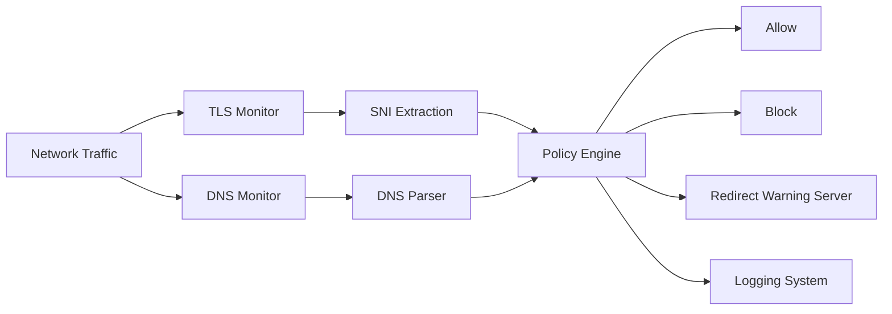

<div align="center">

# 🛰️ SNITracker

### Lightweight Network Intelligence & TLS/DNS Monitoring Toolkit

A modular Python-based toolkit for inspecting **TLS SNI** and **DNS traffic** in real time, enabling domain visibility, logging, and simple policy enforcement without decrypting traffic.

---


</div>

---

## ⚠️ Notice

SNITracker is a **network security and analysis toolkit** intended only for:

- Educational use  
- Security research  
- Systems you own or are authorized to test  

Unauthorized use on external networks may violate laws.

---

## 🌐 Overview

SNITracker is a lightweight monitoring toolkit that analyzes:

- **TLS SNI (Server Name Indication)** from encrypted connections  
- **DNS queries** before encryption occurs  

It provides real-time visibility into network activity without decrypting traffic.

---

## 🧠 Features

- 🔍 Real-time TLS SNI extraction  
- 🌐 DNS query monitoring  
- 🚫 Domain-based blocking rules  
- 🧾 Structured logging (text + JSON mode)  
- 📊 Runtime statistics tracking  
- 🧠 Deduplication to reduce noise  
- 🚧 Warning / block page redirection  
- ⚡ Lightweight Python-based architecture  
- 🔌 Modular tools for each network layer  

---

## 🏗️ Architecture



---

## 📦 Installation

```bash
git clone https://github.com/Mossesmuwa/SNITracker.git
cd SNITracker
pip install -r requirements.txt
```

> ⚠️ Requires administrator/root privileges for packet capture.

---

## 🚀 Usage

### 🔍 SNI Stream Logger
```bash
python sni_stream_logger.py --iface wlan0
```

### 🌐 DNS Monitor
```bash
python dns_monitor.py --iface wlan0 --json
```

### 🚧 SNI Filter Engine (Proxy Mode)
```bash
python sni_filter.py
```

### ⚠️ Warning / Block Page Server
```bash
python warning_server.py --port 8080
```

---

## ⚙️ Configuration

### Blocked Domains
```python
BLOCKED_DOMAINS = {
    "example.com",
    "badsite.com"
}
```

### DNS / SNI Logging
```python
LOG_FILE = "dns_log.txt"
```

### Warning Server
```python
--message "This site is blocked by policy"
```

---

## 📊 Example Output

### SNI / DNS Logs
```
[2026-06-05 14:32:10] google.com
[2026-06-05 14:32:15] github.com
[2026-06-05 14:32:20] badsite.com [FLAGGED]
```

### JSON Mode
```json
{"time": "2026-06-05T14:32:10", "domain": "google.com", "flagged": false}
```

---

## 🚧 Limitations

- Does not decrypt HTTPS traffic  
- Limited against TLS 1.3 Encrypted Client Hello (ECH)  
- Requires elevated privileges  
- Depends on SNI/DNS visibility  
- Not a full DPI or enterprise firewall system  

---

## 🧪 Use Cases

- Network security learning and research  
- Lab environment traffic monitoring  
- DNS and TLS metadata analysis  
- Policy enforcement prototyping  
- Educational cybersecurity projects  

---

## 🧭 Roadmap

- 🌐 Web dashboard (live traffic monitoring)  
- 📍 GeoIP enrichment for domains  
- 🔗 DNS + SNI correlation engine  
- 🤖 Anomaly detection system  
- 🔥 Firewall integration (iptables/nftables)  
- 🧭 Multi-node distributed monitoring  

---

## ⚙️ Tech Stack

- Python 3.8+  
- Scapy (packet inspection)  
- Socket programming  
- Raw TCP stream analysis  
- HTTP server (built-in)

---

## 📄 License

MIT License

---

## 🙌 Inspiration

Built from concepts in network security, TLS metadata inspection, and DNS analysis systems.

Key inspiration:

👉 https://youtu.be/FBwHNMgxmhI  
**David Bambal**

> Encrypted traffic still reveals structure — and structure reveals behavior.
