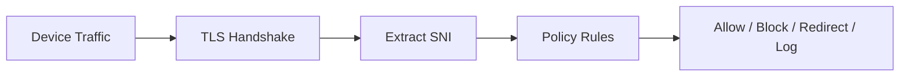

<div align="center">

# 🛰️ SNITracker

### Lightweight TLS SNI Monitoring & Policy Tool

A simple network tool that extracts **Server Name Indication (SNI)** from TLS traffic to provide real-time domain visibility, logging, and basic policy enforcement without decrypting traffic.

---


</div>

---

## ⚠️ Notice

SNITracker is a **network analysis tool** intended only for:

- Educational use  
- Security research  
- Systems you own or are authorized to test  

Do not use it for unauthorized traffic interception.

---

## 🌐 What It Does

SNITracker reads the **TLS handshake** and extracts the SNI (domain name) before the traffic is fully encrypted.

It helps you see which domains are being accessed on a network without decrypting HTTPS traffic.

---

## 🧠 Features

- Extracts SNI from TLS traffic in real time  
- Shows visited domains from encrypted connections  
- Blocks or allows domains using simple rules  
- Logs network activity  
- Can redirect blocked traffic to a warning page  
- Lightweight and written in Python  
- Easy to extend and modify  

---

## 🏗️ How It Works



---

## 📦 Installation

```bash
git clone https://github.com/Mossesmuwa/SNITracker.git
cd SNITracker
pip install scapy
```

> ⚠️ Requires administrator/root permissions to capture network traffic.

---

## 🚀 How to Use

```bash
python sni_logger.py      # Logs visited domains
python sni_filter.py      # Applies blocking rules
python warning_server.py  # Starts warning page server
```

---

## ⚙️ Configuration

### Blocked Domains
```python
BLOCKED_DOMAINS = {"example.com", "badsite.com"}
```

### Warning Server
```python
WARNING_IP = "1.1.1.1"
WARNING_PORT = 8080
```

### Logs
```python
LOG_FILE = "sni_log.txt"
```

---

## 📊 Example Output

```
[2026-06-05 14:32:10] google.com
[2026-06-05 14:32:15] github.com
[2026-06-05 14:32:20] badsite.com → BLOCKED
```

---

## 🚧 Limitations

- Does not decrypt HTTPS traffic  
- Limited with TLS 1.3 Encrypted Client Hello (ECH)  
- Requires admin/root access  
- Works only when SNI is available  
- Not a full firewall or DPI system  

---

## 🧪 Use Cases

- Learning network security basics  
- Monitoring traffic in lab environments  
- Testing simple network policies  
- Security research and experiments  

---

## 🧭 Future Improvements

- Web dashboard for live monitoring  
- GeoIP tracking for domains  
- DNS + SNI correlation  
- Anomaly detection  
- Firewall integration  
- Multi-device monitoring  

---

## ⚙️ Tech Stack

- Python  
- Scapy (packet capture)  
- Raw socket network inspection  

---

## 📄 License

MIT License

---

## 🙌 Inspiration

This project is based on ideas from network security, TLS inspection, and metadata analysis systems.

Key inspiration:

👉 https://youtu.be/FBwHNMgxmhI  
**David Bambal**

> Encrypted traffic still contains useful metadata — and that metadata can reveal important patterns.
